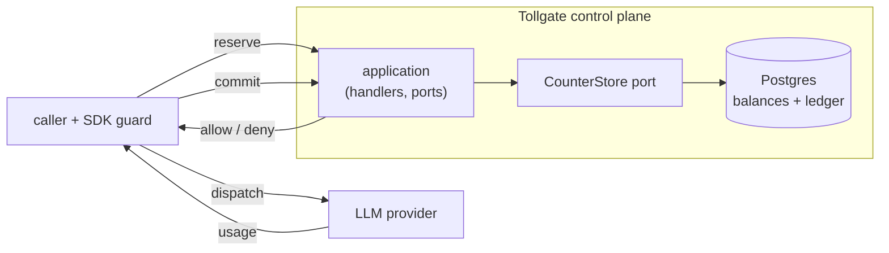

# Tollgate

[](https://github.com/JumpMasters/tollgate/actions/workflows/ci.yml)
[](https://github.com/JumpMasters/tollgate/actions/workflows/codeql.yml)

Tollgate is a spend control plane for AI model usage. It enforces **hard,
pre-charge budgets** on calls to LLM providers and produces an auditable record
of what was spent and by whom. It is **gateway-neutral**: it sits beside
whatever gateway or SDK a team already uses and is consulted synchronously,
before a call dispatches, rather than metering spend after the fact.

The premise is simple: a budget is only real if it can stop the request that
would breach it. So enforcement is a **reservation against a ledger** taken
before the call, reconciled to actual usage when the call completes — the same
shape as overbooking, applied to tokens.

## Status

Tollgate is in early development. The design is documented (see
[Design decisions](#design-decisions) below) and the project is being built
incrementally behind the architecture and quality gates described here. It is
young software: interfaces will change, and it has not yet seen production use.
This repository currently contains the project skeleton — the domain
primitives, configuration, a health endpoint, and the full CI and architecture
enforcement — with the reservation engine landing in subsequent changes.

## Why this shape

Most AI cost tooling meters spend after the fact and bolts *soft* budgets onto a
gateway: the limit is advisory and lags reality, so a runaway loop or a busy
team can overspend before anyone notices. Tollgate takes the opposite position —
the limit is upheld **before** the call dispatches, under real concurrency, and
decoupled from any single gateway. Correctness is something to demonstrate with
a load harness and an offline audit, not merely to assert.

## What it guarantees

The central guarantee is stated honestly:

> `committed ≤ limit` at every budget node, always and unconditionally. Real
> spend beyond the reserved amount is fully audited and attributed — every unit
> carries a ledger row and counts against the node's remaining. Under stable
> provider tokenization, per-call overage is expected to be small; there is no
> universal bound independent of provider-side prompt expansion.

In other words: committed spend never exceeds a limit, by construction. The one
place reality can drift past a reservation is input-tokenization — the realized
prompt tokenizing to more than the bound that was reserved — and that drift is
never silently absorbed. It is recorded as audited *overage*, alerted, and
counted against remaining headroom.

## Domain model

Budgets form a hierarchy — `org → team → user` — plus an orthogonal `project`
axis. A budget may attach to any node. Each node keeps a per-period balance of
`(limit, reserved, committed, overage)`, and `remaining` is what is left after
all three are subtracted. A single request gates against every applicable
budget at once: the user's, its team's, its org's, and any project budget. The
result is most-restrictive — if any node lacks headroom, the request is denied
and the binding node is named.

## Reservation lifecycle

A reservation is a small state machine, and its transitions are the commands:

```
            ┌── commit (actual usage) ──► committed
held ───────┤
(reserve)   ├── cancel (call failed) ───► released
            └── reaper (ttl elapsed) ───► reaped
```

`reserve` takes a worst-case estimate against every applicable budget,
atomically and all-or-nothing. `commit` reconciles to the provider-reported
usage, moving at most the reserved amount into committed and recording any
excess as overage. `cancel` releases a reservation whose call never ran. A
background reaper releases reservations abandoned by a crashed client; a
heartbeat keeps long-running streams alive so a slow-but-live call is never
reaped into a double-spend.

## Concurrency model

The spend invariant has to hold under concurrent traffic across many replicas
and many in-flight streaming calls. Tollgate relies on Postgres for this:
balance mutations are **invariant-guarded conditional writes** — the `WHERE`
clause *is* the guard, so an over-budget reserve simply matches zero rows and is
denied, with no read-modify-write gap and no retry storm. A reserve that touches
several budget rows locks them in a deterministic order to avoid deadlocks, and
the whole command is one transaction. An append-only ledger makes the result
auditable offline.

## Architecture

Ports and adapters, with a pure domain core and boundaries enforced in CI by
[import-linter](https://github.com/seddonym/import-linter).



The `CounterStore` port is the seam where a future Redis fast-path can slot in
without touching ledger semantics or the domain. Enforcement runs in the SDK
guard, which can deny before dispatch; a LiteLLM callback is provided for
post-call metering only.

## Project layout

```
src/tollgate/
  domain/        # pure, no I/O: money, ids, errors, reservation state machine
  application/   # command handlers + the CounterStore / repository ports
  adapters/      # port implementations (Postgres) + integrations (SDK, LiteLLM)
  api/           # FastAPI surface
  workers/       # reservation + idempotency reapers
  config/        # settings
  app.py         # composition root — the only module that wires concretes
tests/           # unit (pure) + integration (real Postgres)
loadtest/        # the correctness-under-load harness
docs/adr/        # architecture decision records
```

## Testing

The test strategy has three pillars: property-based stateful tests of the
budget-tree and reservation logic, concurrency integration tests against a real
Postgres (via testcontainers), and a load harness that drives high-concurrency
traffic at a hot shared budget and runs an invariant oracle over the ledger.
The integration and load tiers require Docker; the unit suite and all static
checks do not.

## Development and checks

```sh
make sync      # install into the uv environment
make verify    # ruff, mypy --strict, import-linter, pytest + coverage, pip-audit
make fmt       # format and autofix
```

Every pull request must be green on the same gates before it can merge. `main`
is protected: no direct pushes, no force-pushes.

## Scope

**In scope for V1:** the budget hierarchy plus project axis; the
reserve → commit / cancel lifecycle with reconciliation; idempotent commands;
per-principal authentication and scope-based authorization; a versioned,
provider-qualified price book; the reapers and streaming heartbeat;
fail-closed enforcement; a chargeback read API; a Python SDK and a LiteLLM
metering callback; and the load harness.

**Not in scope yet — deliberate, documented boundaries:** routing or proxying
model traffic (Tollgate is not a gateway), spend forecasting and anomaly
detection, a Redis fast-path (the seam is built; the implementation is
deferred), multi-currency, a proxy/sidecar enforcement mode, full
multi-tenancy and SSO, a rich web dashboard, semantic caching, budget approval
workflows, and request rate limiting.

## Limitations

Tollgate is deliberate about where its guarantees stop.

- **Enforcement is cooperative, not a network perimeter.** Tollgate upholds the
  budget invariant for traffic that goes through the SDK guard. A caller that
  reaches a provider directly — a raw client holding the provider key — bypasses
  it, and the ledger will not see that spend until the bill arrives. Closing this
  needs a proxy or sidecar that sits in the network path, which is on the roadmap,
  not in V1.
- **Worst-case reservation can cause false denials.** Because `reserve` holds a
  worst-case estimate, a large or uncapped estimate can temporarily hold headroom
  and deny otherwise-admissible concurrent requests until earlier calls reconcile
  and release. This is the safe direction — over-reserving under-admits, it never
  overspends — and it is bounded by a configurable per-model default cap (with a
  strict mode that rejects uncapped calls outright), not by the model's full
  context window.
- **Fail-closed makes the datastore a single point of failure.** The gate is
  consulted synchronously and fails closed by default, so while Postgres is
  unreachable, governed dispatches are denied — zero untracked spend, but no calls
  either. The opt-in, per-budget grace allowance trades strict enforcement for
  availability during an outage (with the exposure quantified as
  `instances × grace`), and Postgres should be run with high availability.

Two further limits are covered above: committed spend never exceeds a limit, but
per-call overage is only expected to be small under stable provider tokenization
(see [What it guarantees](#what-it-guarantees)); and throughput on a single hot
budget node is bounded by Postgres row-level serialization, which the load harness
quantifies and the `CounterStore` Redis seam is intended to relieve (see
[Concurrency model](#concurrency-model)).

## Design decisions

The significant, hard-to-reverse decisions are recorded as Architecture
Decision Records under [`docs/adr`](docs/adr) — the relational core, the
pre-charge reservation model, invariant-guarded conditional writes, the
hierarchical lock ordering, the idempotency policy, the price-book and overage
semantics, and more.

## Contributing

See [CONTRIBUTING.md](CONTRIBUTING.md) for the workflow and standards, and
[SECURITY.md](SECURITY.md) for reporting vulnerabilities.

## License

Apache-2.0. See [LICENSE](LICENSE) and [NOTICE](NOTICE).
